# Data Collection

## Labelling Criteria - Date Categories

During the 2023 Sukkari harvest season, our team spent two months on the
farm, where we deployed the machine and gathered data. We also
interviewed more than 20 farmers and visited multiple farms to develop a
clear understanding of the different grades of Sukkari recognized in the
market. We categorized the dates into five categories:

-   **Mufattal** Sukkari date with a low level of skin delamination,
    gold color, and low level of moisture,
    

  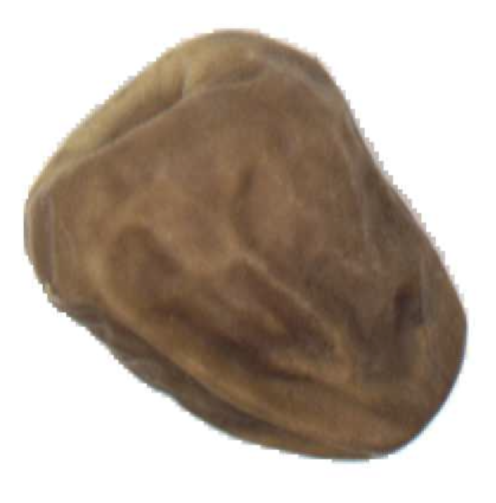

    
-   **Galaxy** Sukkari date with low level of skin delamination, dark
    brown color, low level of moisture,
    
  

  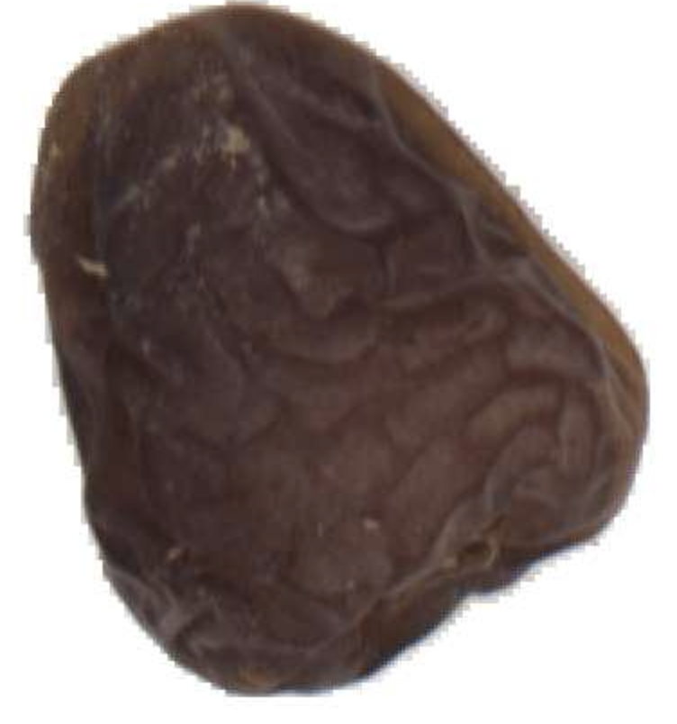

-   **Qisher** Sukkari date with a high level of skin delamination and a
    low level of moisture, regardless of its color,
    

  

    
-   **Rutab** Sukkari date with a high level of moisture,

  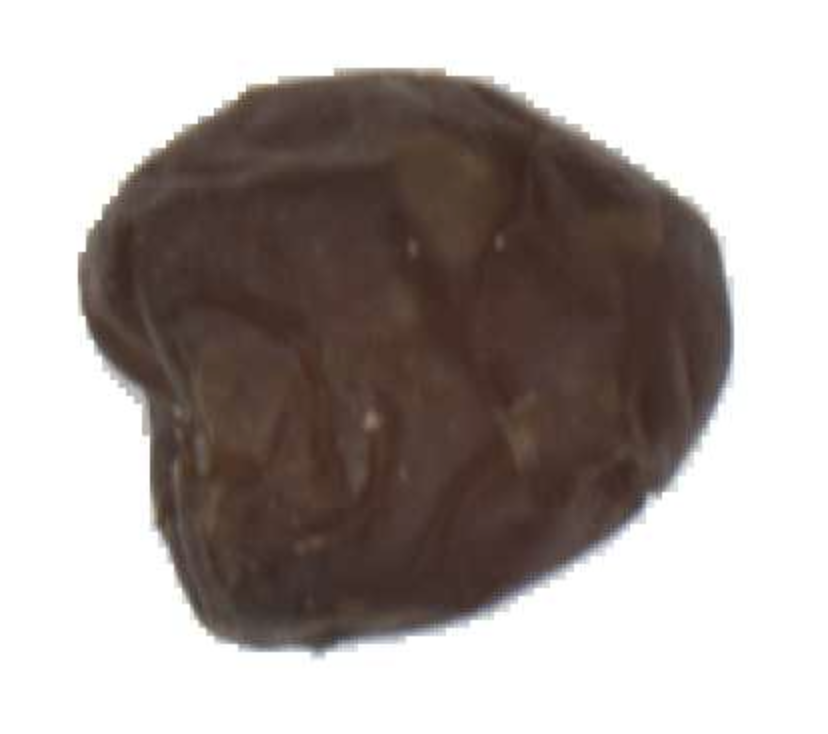

    
-   **Nagad** Undesired and not for market dates which includes dates
    that are bitten by birds, containing mold, very low moisture level
    (very dry). Nagad label was also used to describe any material that
    was carried in from harvesting like wooden sticks or container
    pieces

  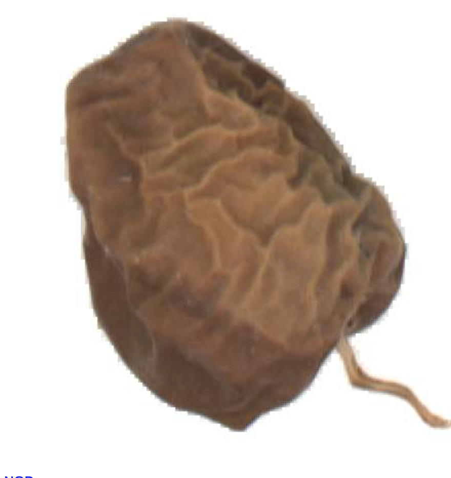

Some variations on how these grades are defined by some farmers were
found. For example, a date with good moisture, color, and tight skin
could still be classified as Qisher if it is considerably small.
However, all the samples collected in this study were sorted by
professionally trained labor (Al-Daif sorting facility in AlBukairiah).

## Data Cleaning

Following the initial collection of date fruit images, a rigorous
cleaning process was implemented to ensure the quality and relevance of
the dataset for classification purposes. The cleaning steps included:

-   **Image Cropping:** Each date image was cropped into a
    $500\times 500$ pixel image with the date in the center. This was
    automated using the date segmentation masks saved while collecting
    the data. This step ensured that the focus remained on the date,
    reducing the data needed for memory. 

  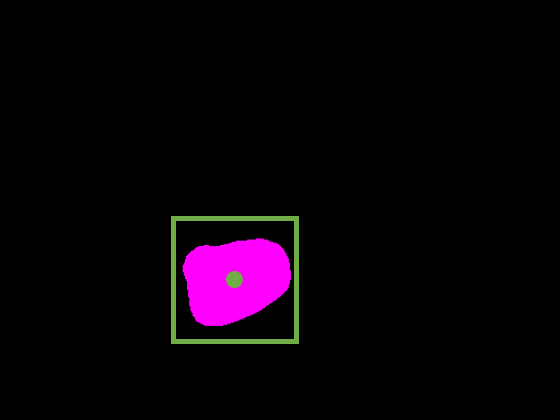
  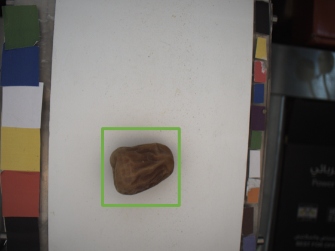
  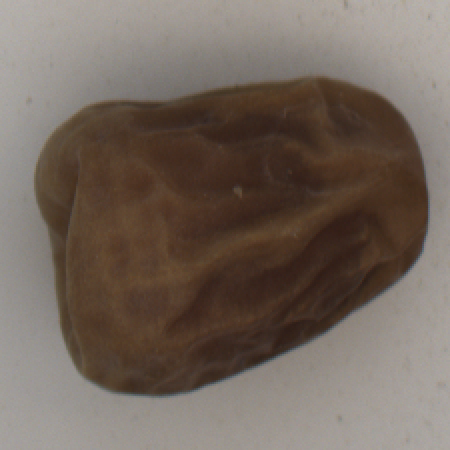
  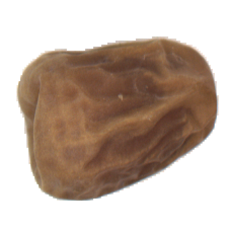
    <figcaption>Fig.1 - Trulli, Puglia, Italy.</figcaption>

-   **Brightness Balancing:** To maintain consistency across the
    dataset, we applied brightness balancing to the cropped images, as
    shown in Figure
    [\[fig:cropping\]](#fig:cropping){reference-type="ref"
    reference="fig:cropping"}(d). This adjustment helped reduce the
    variance caused by different lighting conditions during image
    capture, ensuring uniformity in image quality.
    
-   **Size-Based Filtering:** To eliminate any irrelevant segmented
    objects, we applied size constraints to the cropped images. Only
    segmented objects within a predefined size range were accepted,
    effectively removing any fragments, outliers, or noise that could
    interfere with the classification model.

-   **Manual Removal of Irrelevant Data:** After cropping, we manually
    reviewed all the automatically cropped images and removed any
    irrelevant data. This included partially visible dates, images
    consisting mostly of shadows, images of date skins, and any other
    non-date objects that were inadvertently captured during
    segmentation, as shown in Figure
    [\[fig:cleaning\]](#fig:cleaning){reference-type="ref"
    reference="fig:cleaning"}.

-   **Nagad Subcategorization:** Within the Nagad category, additional
    subcategories were created to identify subtle differences among
    Nagad types, shown in Figure
    [\[fig:nagad\]](#fig:nagad){reference-type="ref"
    reference="fig:nagad"}. This involved classifying very dry, very
    small, unripe, and bitten dates, thereby improving the dataset's
    granularity and accuracy for subsequent classification tasks.

  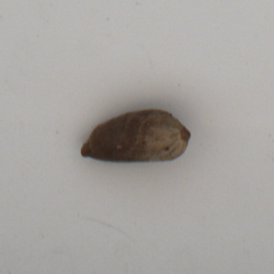
  
  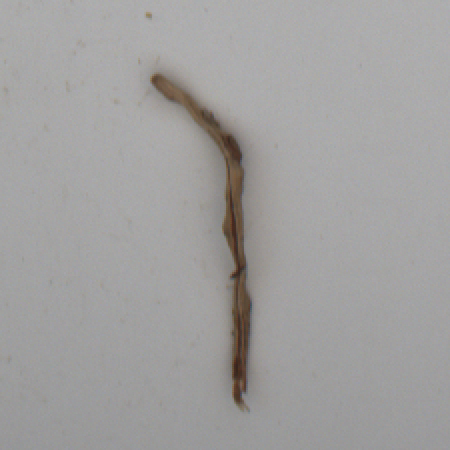
  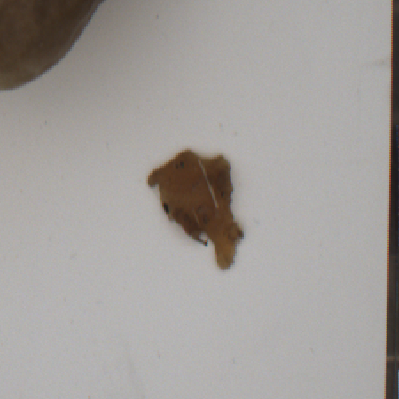
  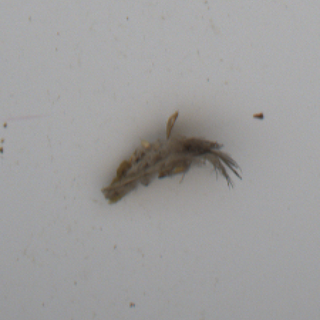
    <figcaption>Fig.1 - Trulli, Puglia, Italy.</figcaption>

  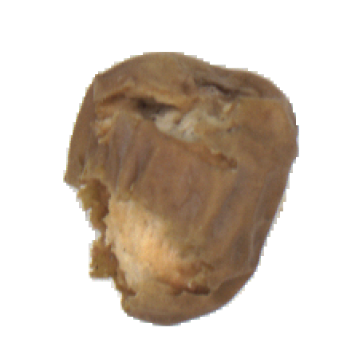
  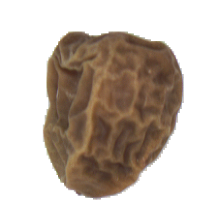
  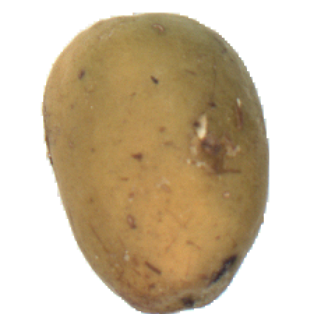
  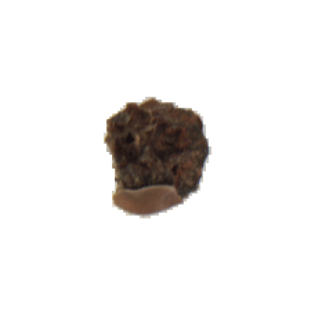
    <figcaption>Fig.1 - Trulli, Puglia, Italy.</figcaption>

