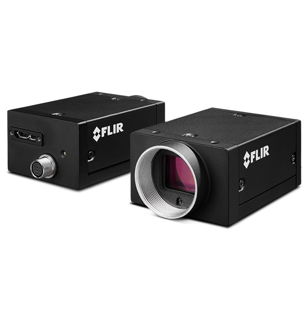

# Data Collection Setup

A data collection system, shown in Figure
[1][Mechanical system],
was designed and manufactured to ensure the capture of high-quality
images of dates through an efficient and automated process. The system
consisted of 3 main components - the mechanical system, the imaging
station and the software.

## Mechanical System

The mechanical system simplified the image collection of large
quantities of dates. Dates were poured into a vibratory feeder, which
funneled them onto a conveyor belt. This conveyor belt then provided a
continuous flow of dates to the imaging station. Then an infrared sensor
(Panasonic CX-491) detects when each date passes by, and a weight sensor
(ZEMIC Load Cell L6N-C3) under the conveyor measures the weight of each
one. Afterwards, the dates moved inside the imaging station, where their
images were captured.

{#fig:mech_system
width="0.5\\linewidth"}

## Imaging Station

The imaging system consisted mainly of a lighting setup along with the
setup of the cameras as described below.

#### Lighting Setup

A combination of LED and halogen lights were used to help produce clear
and properly lit images. Halogen lamps were needed since they emit light
across a wide spectrum, including both visible and infrared wavelengths,
making them particularly useful for capturing NIR images. The system was
enclosed using white sheets to ensure an optimal light distribution, as
shown in Figure [1](#fig:mech_system){reference-type="ref"
reference="fig:mech_system"}.

#### Camera Setup

The camera system incorporated multiple cameras that captured data
across different spectral ranges. An RGB camera (FLIR Blackfly
BFS-U3-31S4C-C), shown in Figure
[\[fig:cameras\]](#fig:cameras){reference-type="ref"
reference="fig:cameras"} (a), was used to capture color data in the
visible spectrum. Additionally, two NIR cameras (FLIR Grasshopper
GS3-U3-41C6NIR-C), shown in Figure
[\[fig:cameras\]](#fig:cameras){reference-type="ref"
reference="fig:cameras"} (b), were used to capture images in the 900 nm
and 970 nm band. A corresponding optical bandpass filter was used for
each camera. More details on the choice of these wavelengths will be
given in Section 4.??. All cameras were connected to a laptop (Lenovo
ThinkPad, Intel i7, 16GB RAM) via USB, which also provided power to the
cameras.

{width="\\textwidth"}

{width="\\textwidth"}

Note that the cameras discussed above are equipped with global shutters.
This feature is essential to reduce motion blur and produce sharp and
clear images. In addition, a careful balance between exposure time,
lighting conditions, and motion blur was established to produce a
high-quality image.

## Software Setup

The software is designed to simplify the processes of capturing,
collecting, and synchronizing data from various sensors, making sure
that all data is accurately time-stamped. Figure
[2](#fig:software_components){reference-type="ref"
reference="fig:software_components"} illustrates the entire process. All
of our software is developed using libraries that are easily accessible,
well-maintained, and open source. Following is a brief overview of the
main components designed to achieve this goal:

{#fig:software_components
width="0.5\\linewidth"}

-   **Image Grabber:** This module manages the control and retrieval of
    images from multiple cameras. To prevent lag in the application, we
    configured the camera buffer to retain only the most recent image,
    ensuring that the latest frame is streamed and retrieved. Within
    this module, the camera thresholds and settings are optimized to
    ensure high-quality image capture. Each image is tagged with a
    timestamp at the time of retrieval.

-   **ROI Selection:** This software module allows us to define and
    select a specific region of interest (ROI) within a full image for
    further processing. It applies a mask to exclude content outside the
    designated ROI, ensuring that only the relevant portion of the image
    is analyzed.

-   **Weight Grabber:** This module establishes a serial connection with
    hardware to capture weight measurements whenever an object passes
    the IR sensor. Each weight reading is tagged with a timestamp from
    the software upon receipt.

-   **Segmenter:** This module performs K-nearest neighbors (KNN)
    background subtraction to segment the date fruit and generate a
    mask. This method was used for its simplicity and efficiency in a
    controlled environment. Post-processing was performed to eliminate
    any extraneous small objects from the segmented output.

-   **Data Logger:** This module associates frame metadata with weight
    measurements, pinpointing the closest matching timestamp and allowed
    delay for each date. To prevent delays from file I/O operations,
    images are stored in batches via a multithreading technique.

When images are captured by the Image Grabber module, the RGB image is
masked using a predefined region of interest (ROI) to restrict the
processing area. This masked RGB image is processed with OpenCV's
implementation of KNN background subtraction, which builds a background
model and detects moving objects in the frames. As a date passes by the
IR sensor, the system records its weight, the date mask, and the raw
images from the RGB, 900 nm, and 970 nm cameras. This data is stored in
a folder named following the format: Label-date of capture belt 1 speed
belt 2 speed.
